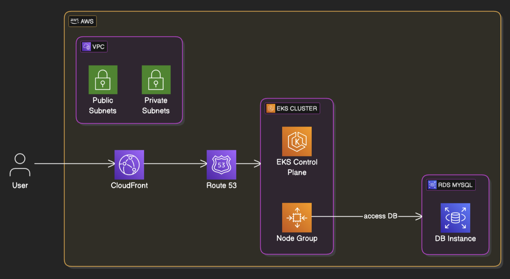

---

# Node.js Application with Docker, Terraform, Helm, and GitHub Actions

This project demonstrates how to deploy a Node.js web application and API using Docker, Terraform, Helm, and GitHub Actions. The infrastructure is provisioned using Terraform, and the applications are deployed to an EKS cluster using Helm. GitHub Actions workflows automate the deployment process.

---

```

[EKS CLUSTER]      [RDS INSTANCE]
web <=> api   <=>       db
```

## **Architecture Diagram**



---

## **Project Structure**

```
.
├── .github/                      # GitHub Actions workflows
│   ├── workflows/
│   │   ├── deploy-infra.yml      # Workflow for infrastructure deployment
│   │   └── deploy-app.yml        # Workflow for application deployment
├── applications/                 # All application-related files
│   ├── helm/                     # Helm chart for deploying applications
│   ├── web/                      # Web application source code
│   ├── api/                      # API application source code
│   └── db/                       # Database initialization scripts
├── infra/                        # Terraform configuration for infrastructure
    ├── rds/                     # Helm chart for deploying applications
│   ├── eks/ 
├── .env                          # Environment variables for local development
├── README.md                     # Project documentation
├── architecture.png              # Architecture diagram
└── .gitignore                    # Git ignore file
```

---

## **Prerequisites**

1. **AWS Account**: Ensure you have an AWS account with the necessary permissions to create EKS clusters, RDS instances, and ECR repositories.
2. **Terraform**: Install Terraform on your local machine.
3. **Helm**: Install Helm on your local machine.
4. **kubectl**: Install `kubectl` and configure it to access your EKS cluster.
5. **Docker**: Install Docker on your local machine.
6. **GitHub Secrets**: Set up the required secrets in your GitHub repository (see below).

---

## **Setup**

### **1. Set Up GitHub Secrets**
Add the following secrets to your GitHub repository:

- **AWS Credentials**:
  - `AWS_ACCESS_KEY_ID`
  - `AWS_SECRET_ACCESS_KEY`
  - `AWS_REGION`

- **ECR Repository URL**:
  - `ECR_REPO_URL` (e.g., `123456789012.dkr.ecr.us-west-2.amazonaws.com`)

- **Database Credentials**:
  - `DB_HOST` (RDS endpoint)
  - `DB_USER`
  - `DB_PASSWORD`
  - `DB_NAME`

---

### **2. Deploy Infrastructure**
1. **Terraform Configuration**:
   - Update the `terraform/main.tf` file with your desired infrastructure configuration.
   - Initialize Terraform:
     ```bash
     cd terraform
     terraform init
     ```
   - Apply the Terraform configuration:
     ```bash
     terraform apply
     ```

2. **GitHub Workflow**:
   - Push changes to the `infra` branch to trigger the infrastructure deployment workflow.

---

### **3. Build and Push Docker Images**
1. **Build Images Locally**:
   - Build the Docker images for the web and API applications:
     ```bash
     docker build -t your-web-image:latest ./applications/web
     docker build -t your-api-image:latest ./applications/api
     ```
   - Push the images to Amazon ECR:
     ```bash
     docker tag your-web-image:latest <your-ecr-repo>/web:latest
     docker tag your-api-image:latest <your-ecr-repo>/api:latest
     docker push <your-ecr-repo>/web:latest
     docker push <your-ecr-repo>/api:latest
     ```

2. **GitHub Workflow**:
   - Push changes to the `master` branch to trigger the application deployment workflow.

---

### **4. Deploy Applications**
1. **Helm Chart**:
   - Update the `applications/helm/nonso-app/values.yaml` file with the correct image names and RDS credentials.
   - Deploy the Applicationn Helm chart to your EKS cluster:
     ```bash
     helm install nonso-app ./applications/helm
     ```
   - Deploy the monitoring Helm chart to your EKS cluster:
     ```bash
     helm install prometheus-stack ./applications/monitoring -n monitoring
     ```

2. **GitHub Workflow**:
   - The application deployment workflow will automatically build, push, and deploy the applications.

---

## **Workflows**

### **1. Infrastructure Deployment**
- **File**: `.github/workflows/deploy-infra.yml`
- **Trigger**: Push to the `infra` branch.
- **Actions**:
  - Runs `terraform init`, `terraform validate`, `terraform plan`, and `terraform apply`.

### **2. Application Deployment**
- **File**: `.github/workflows/deploy-app.yml`
- **Trigger**: Push to the `master` branch.
- **Actions**:
  - Builds and pushes Docker images to Amazon ECR.
  - Deploys the Helm charts to the EKS cluster.

---

## **Access the Applications**

- **Web Application**: `http://app-assess.chebsam.people.aws.dev/web`
- **API Application**: `http://app-assess.chebsam.people.aws.dev/api`
- **Website **: `http://jak.chebsam.people.aws.dev/`

---

## **Clean Up**

1. **Uninstall Helm Chart**:
   ```bash
   helm uninstall nonso-app
   ```
   ```bash
   helm uninstall prometheus-stack -n monitoring
   ```

2. **Destroy Infrastructure**:
   ```bash
   cd terraform
   terraform destroy
   ```

---