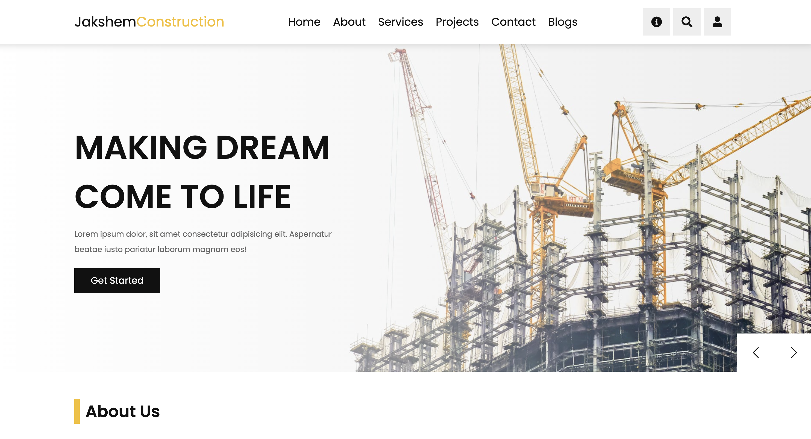

This is a HTML, CSS and Javascript project



## Getting Started Locally

1. Clone the repo:

```bash
git clone https://github.com/devopsengineersam/JakshemConstruction.git
```

2. Navigate to the root project folder:

```bash
cd JakshemConstruction
```

3. View the development server:

open the `index.html` :+1: file with your browser to see the result.


You can start editing the page by modifying `index.html`. After modifying the file, refresh the browser to see the changes


## Getting Started with Docker -- Recommended

1. Clone the repo:  --- ( Skip this step if you had already clone repo in -- (Getting Started Locally) step)

```bash
git clone https://github.com/devopsengineersam/JakshemConstruction.git
```

2. Navigate to the root project folder:

```bash
cd JakshemConstruction
```
3. Build the project:

```bash
docker build -t construction-web .
```

4. Test the docker image locally:

```bash
docker run --name construction -p 80:80 construction-web
```
Open [http://localhost:80](http://localhost:80) :ok_hand: with your browser to see the result. There you go! :fire:

## Pushing the image to ECR registy and updating the deployment

1. Tag the build and Push it to a private registry in ECR. For example:
```bash
docker tag construction-web:latest 533267037417.dkr.ecr.us-east-1.amazonaws.com/construction:v5 # change this tag to the latest tag
docker push 533267037417.dkr.ecr.us-east-1.amazonaws.com/construction:v5
```

2. Update the deployment.yaml file with the latest image tag and run the deployment:

```bash
spec:
      containers:
      - name: construction-web
        image: 533267037417.dkr.ecr.us-east-1.amazonaws.com/construction:v1.1.0
        ports:
        - containerPort: 80

kubectl apply -f deployment.yaml
```

This is assuming you have already logged in to the EKS cluster on AWS and updated the kube config context on your terminal.

Happy coding! :muscle: by devopsengineersam:sauropod:
